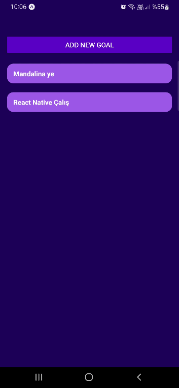

# To Do App - React Native

This is a simple to do app with React Native.
If you want to run, you should run this code first.
 
`npm install`
 
and then
 
`npx expo start`
 
Your app should look like this :
 

